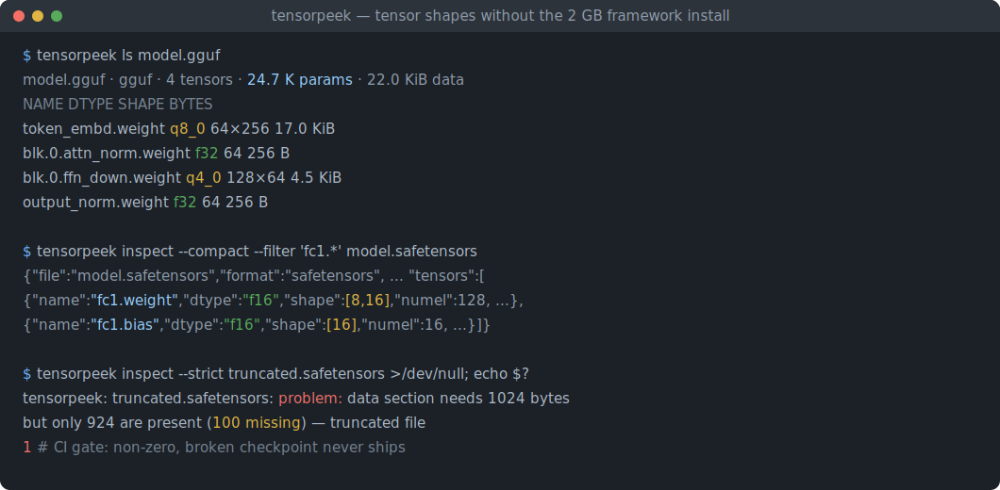
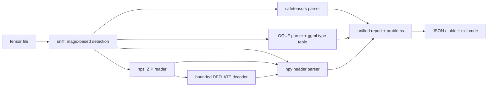

# tensorpeek

[English](README.md) | [中文](README.zh.md) | [日本語](README.ja.md)

[](LICENSE) [](Cargo.toml) [](CHANGELOG.md)  [](CONTRIBUTING.md)

**tensorpeek：safetensors・GGUF・npy・npz のヘッダを JSON として検査するゼロ依存 CLI —— テンソルの形状確認に 2 GB のフレームワークはもう要らない。**



```bash
git clone https://github.com/JaydenCJ/tensorpeek.git && cargo install --path tensorpeek
```

> プレリリース：v0.1.0 はまだ crates.io に公開されていません。上記のとおりソースからビルドしてください（Rust ≥1.75、依存ゼロ）。

## なぜ tensorpeek？

テンソルの形状を一つ確認するために PyTorch をインストールする必要はないはずです。それなのに「この checkpoint には何が入っている？」への定番の答えは、フレームワークごと引き込む Python ワンライナーのまま：safetensors パッケージが 1 形式、`gguf_dump.py` が別の 1 形式、`.npy`/`.npz` は numpy —— どれも完全な ML ツールチェーンを前提とする形式別スクリプトで、答えが本当に必要なスリムな CI コンテナには一つも入っていません。tensorpeek は 1 つの静的バイナリで、統一 JSON schema により 4 形式すべてを理解します：ファイルが Python の学習ループ由来でも llama.cpp の量子化器由来でも、`.tensors[].shape` の意味は同じです。読むのはヘッダ領域だけ —— 40 GB の checkpoint もミリ秒で検査でき、`np.savez_compressed` アーカイブ内のメンバさえ、内蔵の有界 DEFLATE デコーダのおかげで対象です。しかも dtype × shape から全サイズを再計算するため、切り詰められたアップロードをバイト単位で正確に検出し、CI がゲートできる終了コードに変えます。

|  | tensorpeek | safetensors (Python) | gguf_dump.py | numpy / np.load |
|---|---|---|---|---|
| 対応形式 | ✅ 4 形式すべて | safetensors のみ | GGUF のみ | npy / npz のみ |
| ランタイム依存 | 0 —— 静的バイナリ 1 つ | Python + pip パッケージ | Python + gguf パッケージ | Python + numpy |
| スリムな CI イメージで動く | ✅ | ❌ Python スタック必須 | ❌ Python スタック必須 | ❌ Python スタック必須 |
| 40 GB ファイルでもヘッダのみ読む | ✅ ミリ秒・全形式 | ✅ | ✅ | 部分的¹ |
| JSON 出力 + CI 終了コード | ✅ 内蔵 | 自前スクリプト | ❌ 整形表示のみ | 自前スクリプト |
| 切り詰めをバイト単位で検出 | ✅ 欠損バイト数つき | ❌ | ❌ | ロード時にやっと |
| 圧縮された npz メンバ | ✅ 有界 inflate | 対象外 | 対象外 | 全量展開 |

<sub>¹ `np.load(mmap_mode=...)` なら `.npy` はデータを読まずに済むが、圧縮 `.npz` メンバは全量展開される；比較は 2026-07 時点（safetensors 0.5.x、llama.cpp の gguf-py、numpy 2.x）。</sub>

## 特徴

- **4 形式・1 schema** —— safetensors、GGUF（v2/v3）、npy（1.0–3.0）、npz が同じレポートを出力：`file_bytes`、`header_bytes`、`data_bytes`、`tensor_count`、`parameters`、`metadata`、name/dtype/shape/offset/bytes を持つ `tensors[]`、そして `problems[]`。
- **ヘッダのみ・巨大ファイルもミリ秒** —— safetensors の JSON ヘッダ、GGUF のメタデータ + テンソル情報、npy の先頭 ≤64 KiB、npz の ZIP セントラルディレクトリ；テンソルデータは決して読まず、サイズは dtype × shape から ggml ブロック幾何テーブルで算出。
- **切り詰めをバイト単位で捕捉** —— 各パーサがヘッダの約束するデータ長と実ファイルを突き合わせ、欠けているバイト数を正確に報告；`--strict` はあらゆる problem を終了コード 1 に変えて CI ゲートにする。
- **圧縮 npz も対象** —— 有界 raw-DEFLATE デコーダ（stored・固定・動的 Huffman ブロック、純 `std` 実装）が `np.savez_compressed` アーカイブから各メンバの npy ヘッダをデータ展開なしで取り出す；ZIP64 アーカイブにも対応。
- **パイプライン向け設計** —— 整形 / `--compact` JSON、glob 式 `--filter 'blk.*.weight'`、`--no-tensors`、GGUF トークナイザ語彙向けの `--array-limit`/`--full-arrays`、安定した schema キー、`| head` や `| grep -q` に強い EPIPE 安全な出力。
- **敵対的入力への耐性** —— 割り当て前の件数妥当性チェック、文字列/配列長の事前検査、ネスト深度上限、safetensors ヘッダの 100 MB 上限、ビッグエンディアン GGUF のヒント表示；不正なファイルにはエラーメッセージを返し、決して panic しない。
- **依存ゼロ・ネットワークゼロ** —— JSON パーサ/シリアライザ、ZIP リーダ、DEFLATE デコーダまで含めて純 `std` Rust；ローカルファイルを読み、stdout に書くだけで、どこにも何も送らない。

## クイックスタート

インストール（Rust 1.75+ が必要）：

```bash
git clone https://github.com/JaydenCJ/tensorpeek.git && cargo install --path tensorpeek
```

リポジトリ内の仕様準拠ライタで 4 形式のデモファイルを生成し、中身を見てみます：

```bash
cd tensorpeek
cargo run --example gen_fixtures -- /tmp/fixtures
tensorpeek ls /tmp/fixtures/model.gguf
```

出力（そのまま取得）：

```text
/tmp/fixtures/model.gguf · gguf · 4 tensors · 24.7 K params · 22.0 KiB data
NAME                    DTYPE  SHAPE   BYTES
token_embd.weight       q8_0   64×256  17.0 KiB
blk.0.attn_norm.weight  f32    64      256 B
blk.0.ffn_down.weight   q4_0   128×64  4.5 KiB
output_norm.weight      f32    64      256 B
```

同じファイルをフィルタつき JSON で —— そのまま `jq` に渡せます（`examples/shape-gate.sh` のように `grep` だけでも）：

```bash
tensorpeek inspect --compact --filter 'fc1.*' /tmp/fixtures/model.safetensors
```

```text
{"file":"/tmp/fixtures/model.safetensors","format":"safetensors","file_bytes":1592,"header_bytes":280,"data_bytes":1312,"tensor_count":3,"parameters":400,"safetensors":{"header_json_bytes":272},"metadata":{"format":"pt","producer":"gen_fixtures"},"tensors":[{"name":"fc1.weight","dtype":"f16","shape":[8,16],"numel":128,"offset":1024,"bytes":256},{"name":"fc1.bias","dtype":"f16","shape":[16],"numel":16,"offset":1280,"bytes":32}]}
```

切り詰められた checkpoint は `--strict` なしでは記述され、ありではゲートされます —— 終了コードは 1、壊れたアップロードは決して出荷されません：

```text
tensorpeek: /tmp/fixtures/truncated.safetensors: problem: data section needs 1024 bytes but only 924 are present (100 missing) — truncated file
```

## 出力 schema

ファイルごとに 1 つの JSON オブジェクト（複数ファイルなら配列）；キーは追加されるのみで、改名は決してしません。完全な schema と形式別の注意 —— GGUF の形状順序の注意点を含む —— は [docs/output-schema.md](docs/output-schema.md) にあります。

| Key | Type | Meaning |
|---|---|---|
| `format` | string | `safetensors`・`gguf`・`npy`・`npz`（magic による判定） |
| `header_bytes` / `data_bytes` | int | ヘッダ/索引のサイズ vs. ヘッダが約束するデータ量 |
| `tensor_count` / `parameters` | int | テンソル数と総要素数（`--filter` の影響を受けない） |
| `tensors[]` | array | `name`・`dtype`・`shape`・`numel`・`offset`・`bytes` + 形式別の追加項目 |
| `problems[]` | array | 非致命的な異常：切り詰め、サイズ不一致、未知の dtype |

## CLI オプション

| Key | Default | Effect |
|---|---|---|
| `--compact` | off | 整形せず 1 行の JSON で出力 |
| `--filter <GLOB>` | none | 一致するテンソルのみ列挙（`*`/`?`、カンマ区切りで複数指定） |
| `--no-tensors` | off | テンソル一覧を省略；件数は残る |
| `--array-limit <N>` | 16 | N より長い GGUF メタデータ配列を要約（`--full-arrays` で解除） |
| `--strict` | off | problem のあるファイルで終了コード 1 |
| `--as <FORMAT>` | auto | 判定をスキップ：`safetensors` \| `gguf` \| `npy` \| `npz` |

終了コード：`0` = 全ファイル解析成功、`1` = 解析失敗または `--strict` が problem を検出、`2` = 用法エラーか読めない入力。`tensorpeek formats` が判定ルールを説明します。

## 検証

このリポジトリは CI を同梱しません。上記の主張はすべてローカル実行で検証しています：`cargo test`（ユニット 77 + CLI 統合 11 テスト）と `bash scripts/smoke.sh` —— 後者は 4 形式の実ファイルを生成してバイナリをエンドツーエンドで駆動し、必ず `SMOKE OK` を出力します。

## アーキテクチャ



## ロードマップ

- [x] コア検査器：4 形式を 1 つの JSON schema で、ヘッダのみ読み取り、リポジトリ内 JSON/ZIP/DEFLATE、バイト単位の切り詰め検出、glob フィルタ、`--strict` CI ゲート、88 テスト + smoke スクリプト
- [ ] ONNX と PyTorch `.pt`/`.bin`（zip 入り pickle）のヘッダ対応
- [ ] `tensorpeek diff a.safetensors b.gguf` —— 形式をまたいだ形状/dtype 比較
- [ ] シャード化 checkpoint の索引ファイル（`model.safetensors.index.json`）
- [ ] 表計算向けテンソル表の `--format csv`
- [ ] レイアウト調査用のバイトオーダ・アラインメントのヒストグラム

全リストは [open issues](https://github.com/JaydenCJ/tensorpeek/issues) を参照してください。

## コントリビュート

コントリビューションを歓迎します —— [CONTRIBUTING.md](CONTRIBUTING.md) を読み、[good first issue](https://github.com/JaydenCJ/tensorpeek/issues?q=is%3Aissue+is%3Aopen+label%3A%22good+first+issue%22) から始めるか、[discussion](https://github.com/JaydenCJ/tensorpeek/discussions) を立ててください。

## ライセンス

[MIT](LICENSE)
