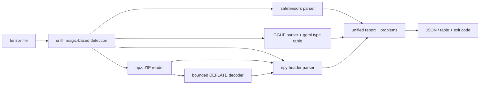

# tensorpeek

[English](README.md) | [中文](README.zh.md) | [日本語](README.ja.md)

[](LICENSE) [](Cargo.toml) [](CHANGELOG.md)  [](CONTRIBUTING.md)

**tensorpeek：One zero-dependency CLI that inspects safetensors, GGUF, npy and npz headers as JSON — tensor shapes without the 2 GB framework install.**


```bash
git clone https://github.com/JaydenCJ/tensorpeek.git && cargo install --path tensorpeek
```

> Pre-release: v0.1.0 is not on crates.io yet; build from source as above (any Rust ≥1.75, zero dependencies).

## Why tensorpeek?

Checking a tensor shape should not require installing PyTorch. Yet the standard answer to "what's inside this checkpoint?" is a Python one-liner that drags in a framework: the `safetensors` package for one format, `gguf_dump.py` for another, numpy for `.npy`/`.npz` — each a per-format script assuming the full ML toolchain, none of them present in the slim CI container where you actually need the answer. tensorpeek is a single static binary that understands all four formats through one unified JSON schema: `.tensors[].shape` means the same thing whether the file came from a Python training loop or a llama.cpp quantizer. It reads only header regions — a 40 GB checkpoint is inspected in milliseconds, including members inside `np.savez_compressed` archives, thanks to a bounded in-repo DEFLATE decoder. And because it recomputes every size from dtype × shape, it detects a truncated upload byte-exactly and turns it into an exit code your CI can gate on.

|  | tensorpeek | safetensors (Python) | gguf_dump.py | numpy / np.load |
|---|---|---|---|---|
| Formats covered | ✅ all four | safetensors only | GGUF only | npy / npz only |
| Runtime dependencies | 0 — one static binary | Python + pip package | Python + gguf package | Python + numpy |
| Works in a slim CI image | ✅ | ❌ needs Python stack | ❌ needs Python stack | ❌ needs Python stack |
| Header-only reads on 40 GB files | ✅ ms, all formats | ✅ | ✅ | partial¹ |
| JSON output + CI exit codes | ✅ built in | DIY scripting | ❌ pretty-prints | DIY scripting |
| Detects truncation byte-exactly | ✅ with missing count | ❌ | ❌ | at load time |
| Compressed npz members | ✅ bounded inflate | n/a | n/a | decompresses fully |

<sub>¹ `np.load(mmap_mode=...)` avoids reading data for `.npy`, but compressed `.npz` members are decompressed in full; comparison as of 2026-07 (safetensors 0.5.x, gguf-py from llama.cpp, numpy 2.x).</sub>

## Features

- **Four formats, one schema** — safetensors, GGUF (v2/v3), npy (1.0–3.0) and npz produce the same report: `file_bytes`, `header_bytes`, `data_bytes`, `tensor_count`, `parameters`, `metadata`, `tensors[]` with name/dtype/shape/offset/bytes, and `problems[]`.
- **Header-only, milliseconds on huge files** — safetensors JSON header, GGUF metadata + tensor infos, the first ≤64 KiB of an npy, the ZIP central directory of an npz; tensor data is never loaded, sizes are computed from dtype × shape via the ggml block-geometry table.
- **Truncation caught byte-exactly** — every parser cross-checks the promised data section against the actual file and reports precisely how many bytes are missing; `--strict` turns any problem into exit code 1 for CI gates.
- **Compressed npz included** — a bounded raw-DEFLATE decoder (stored, fixed and dynamic Huffman blocks, written on `std` alone) extracts each member's npy header from `np.savez_compressed` archives without decompressing the data; ZIP64 archives are supported.
- **Built for pipelines** — pretty or `--compact` JSON, glob `--filter 'blk.*.weight'`, `--no-tensors`, `--array-limit`/`--full-arrays` for GGUF tokenizer vocabularies, stable schema keys, EPIPE-safe output for `| head` and `| grep -q`.
- **Hostile-input hardened** — count plausibility checks before any allocation, string/array length pre-checks, nesting depth caps, a 100 MB safetensors header cap and a big-endian GGUF hint; malformed files get an error message, never a panic.
- **Zero dependencies, zero network** — pure `std` Rust including the JSON parser/serializer, ZIP reader and DEFLATE decoder; reads local files, writes to stdout, sends nothing anywhere.

## Quickstart

Install (requires Rust 1.75+):

```bash
git clone https://github.com/JaydenCJ/tensorpeek.git && cargo install --path tensorpeek
```

Generate demo files in all four formats with the in-repo spec-exact writers, then look inside:

```bash
cd tensorpeek
cargo run --example gen_fixtures -- /tmp/fixtures
tensorpeek ls /tmp/fixtures/model.gguf
```

Output (captured verbatim):

```text
/tmp/fixtures/model.gguf · gguf · 4 tensors · 24.7 K params · 22.0 KiB data
NAME                    DTYPE  SHAPE   BYTES
token_embd.weight       q8_0   64×256  17.0 KiB
blk.0.attn_norm.weight  f32    64      256 B
blk.0.ffn_down.weight   q4_0   128×64  4.5 KiB
output_norm.weight      f32    64      256 B
```

The same file as JSON, filtered — ready for `jq` (or plain `grep`, as in `examples/shape-gate.sh`):

```bash
tensorpeek inspect --compact --filter 'fc1.*' /tmp/fixtures/model.safetensors
```

```text
{"file":"/tmp/fixtures/model.safetensors","format":"safetensors","file_bytes":1592,"header_bytes":280,"data_bytes":1312,"tensor_count":3,"parameters":400,"safetensors":{"header_json_bytes":272},"metadata":{"format":"pt","producer":"gen_fixtures"},"tensors":[{"name":"fc1.weight","dtype":"f16","shape":[8,16],"numel":128,"offset":1024,"bytes":256},{"name":"fc1.bias","dtype":"f16","shape":[16],"numel":16,"offset":1280,"bytes":32}]}
```

A truncated checkpoint is described without `--strict` and gated with it — the exit code is 1, so a broken upload never ships:

```text
tensorpeek: /tmp/fixtures/truncated.safetensors: problem: data section needs 1024 bytes but only 924 are present (100 missing) — truncated file
```

## Output schema

One JSON object per file (an array for several files); keys are only ever added, never renamed. The full schema and per-format notes — including the GGUF shape-order caveat — live in [docs/output-schema.md](docs/output-schema.md).

| Key | Type | Meaning |
|---|---|---|
| `format` | string | `safetensors`, `gguf`, `npy` or `npz` (magic-based detection) |
| `header_bytes` / `data_bytes` | int | Header/index size vs. data the header promises |
| `tensor_count` / `parameters` | int | Tensor and total element counts (unaffected by `--filter`) |
| `tensors[]` | array | `name`, `dtype`, `shape`, `numel`, `offset`, `bytes` + format extras |
| `problems[]` | array | Non-fatal irregularities: truncation, size mismatches, unknown dtypes |

## CLI options

| Key | Default | Effect |
|---|---|---|
| `--compact` | off | Single-line JSON instead of pretty-printed |
| `--filter <GLOB>` | none | Only list matching tensors (`*`/`?`, comma-separated alternatives) |
| `--no-tensors` | off | Omit the tensor list; counts stay |
| `--array-limit <N>` | 16 | Summarize GGUF metadata arrays longer than N (`--full-arrays` lifts it) |
| `--strict` | off | Exit 1 when a file has problems |
| `--as <FORMAT>` | auto | Skip detection: `safetensors` \| `gguf` \| `npy` \| `npz` |

Exit codes: `0` = every file parsed, `1` = a parse failure or `--strict` problems, `2` = usage error or unreadable input. `tensorpeek formats` explains the detection rules.

## Verification

This repository ships no CI; every claim above is verified by local runs: `cargo test` (77 unit + 11 CLI integration tests) and `bash scripts/smoke.sh`, which generates real files in all four formats and drives the binary end to end — it must print `SMOKE OK`.

## Architecture



## Roadmap

- [x] Core inspector: four formats behind one JSON schema, header-only reads, in-repo JSON/ZIP/DEFLATE, byte-exact truncation detection, glob filtering, `--strict` CI gating, 88 tests + smoke script
- [ ] ONNX and PyTorch `.pt`/`.bin` (zip-of-pickle) header support
- [ ] `tensorpeek diff a.safetensors b.gguf` — compare shapes/dtypes across formats
- [ ] Sharded checkpoint index files (`model.safetensors.index.json`)
- [ ] `--format csv` for spreadsheet-bound tensor tables
- [ ] Byte-order and alignment histograms for layout debugging

See the [open issues](https://github.com/JaydenCJ/tensorpeek/issues) for the full list.

## Contributing

Contributions are welcome — see [CONTRIBUTING.md](CONTRIBUTING.md), start with a [good first issue](https://github.com/JaydenCJ/tensorpeek/issues?q=is%3Aissue+is%3Aopen+label%3A%22good+first+issue%22) or open a [discussion](https://github.com/JaydenCJ/tensorpeek/discussions).

## License

[MIT](LICENSE)
