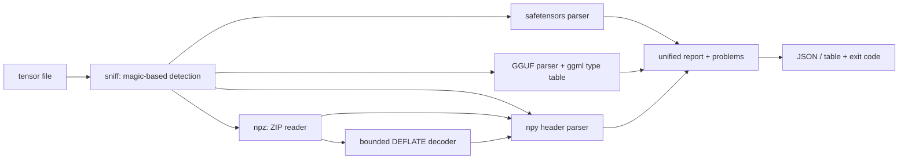

# tensorpeek

[English](README.md) | [中文](README.zh.md) | [日本語](README.ja.md)

[](LICENSE) [](Cargo.toml) [](CHANGELOG.md)  [](CONTRIBUTING.md)

**tensorpeek：一个零依赖 CLI，把 safetensors、GGUF、npy、npz 的文件头解析成 JSON —— 查张量形状不再需要装 2 GB 的框架。**


```bash
git clone https://github.com/JaydenCJ/tensorpeek.git && cargo install --path tensorpeek
```

> 预发布：v0.1.0 尚未上架 crates.io；请按上述方式从源码构建（任意 Rust ≥1.75，零依赖）。

## 为什么选 tensorpeek？

查一个张量的形状不应该要求先装 PyTorch。可是"这个 checkpoint 里有什么？"的标准答案至今仍是一段会拖进整个框架的 Python 单行代码：safetensors 包管一种格式，`gguf_dump.py` 管另一种，`.npy`/`.npz` 归 numpy —— 每个都是假定完整 ML 工具链在场的单格式脚本，而在你真正需要答案的精简 CI 容器里它们一个都不在。tensorpeek 是一个静态单二进制，用同一套 JSON schema 理解全部四种格式：无论文件来自 Python 训练循环还是 llama.cpp 量化器，`.tensors[].shape` 的含义完全一致。它只读文件头区域 —— 40 GB 的 checkpoint 毫秒级完成检查，连 `np.savez_compressed` 归档内的成员也不例外，靠的是内置的有界 DEFLATE 解码器。而且它按 dtype × shape 重新计算每个尺寸，能逐字节精确地发现被截断的上传，并把它变成 CI 可以门禁的退出码。

|  | tensorpeek | safetensors (Python) | gguf_dump.py | numpy / np.load |
|---|---|---|---|---|
| 覆盖的格式 | ✅ 全部四种 | 仅 safetensors | 仅 GGUF | 仅 npy / npz |
| 运行时依赖 | 0 —— 一个静态二进制 | Python + pip 包 | Python + gguf 包 | Python + numpy |
| 能跑在精简 CI 镜像里 | ✅ | ❌ 需要 Python 栈 | ❌ 需要 Python 栈 | ❌ 需要 Python 栈 |
| 40 GB 文件只读文件头 | ✅ 毫秒级，全格式 | ✅ | ✅ | 部分¹ |
| JSON 输出 + CI 退出码 | ✅ 内置 | 自己写脚本 | ❌ 只会美化打印 | 自己写脚本 |
| 逐字节精确发现截断 | ✅ 报缺失字节数 | ❌ | ❌ | 要等加载时 |
| 压缩的 npz 成员 | ✅ 有界 inflate | 不适用 | 不适用 | 全量解压 |

<sub>¹ `np.load(mmap_mode=...)` 可以让 `.npy` 不读数据，但压缩的 `.npz` 成员仍会被完整解压；对比截至 2026-07（safetensors 0.5.x、llama.cpp 的 gguf-py、numpy 2.x）。</sub>

## 特性

- **四种格式，一套 schema** —— safetensors、GGUF（v2/v3）、npy（1.0–3.0）与 npz 产出相同的报告：`file_bytes`、`header_bytes`、`data_bytes`、`tensor_count`、`parameters`、`metadata`、带 name/dtype/shape/offset/bytes 的 `tensors[]`，以及 `problems[]`。
- **只读文件头，超大文件毫秒完成** —— safetensors 的 JSON 头、GGUF 的元数据 + 张量信息、npy 的前 ≤64 KiB、npz 的 ZIP 中央目录；张量数据从不加载，尺寸按 dtype × shape 经 ggml 块几何表计算得出。
- **逐字节抓出截断** —— 每个解析器都把头部承诺的数据段和文件实际大小交叉核对，精确报告缺了多少字节；`--strict` 把任何 problem 变成退出码 1，直接用作 CI 门禁。
- **压缩 npz 也在内** —— 一个有界 raw-DEFLATE 解码器（stored、固定与动态 Huffman 块，纯 `std` 写成）从 `np.savez_compressed` 归档中取出每个成员的 npy 头而不解压数据；支持 ZIP64 归档。
- **为流水线而生** —— 美化或 `--compact` JSON、glob 式 `--filter 'blk.*.weight'`、`--no-tensors`、针对 GGUF 分词器词表的 `--array-limit`/`--full-arrays`、稳定的 schema 键名、对 `| head` 和 `| grep -q` 友好的 EPIPE 安全输出。
- **对恶意输入硬化** —— 任何分配之前先做数量合理性检查、字符串/数组长度预检、嵌套深度上限、100 MB 的 safetensors 头上限和大端 GGUF 提示；畸形文件得到错误信息，绝不 panic。
- **零依赖、零网络** —— 纯 `std` Rust，连 JSON 解析/序列化、ZIP 读取和 DEFLATE 解码都在仓库内；只读本地文件、只写 stdout，不向任何地方发送任何东西。

## 快速上手

安装（需要 Rust 1.75+）：

```bash
git clone https://github.com/JaydenCJ/tensorpeek.git && cargo install --path tensorpeek
```

用仓库内符合规范的写入器生成四种格式的演示文件，然后看看里面：

```bash
cd tensorpeek
cargo run --example gen_fixtures -- /tmp/fixtures
tensorpeek ls /tmp/fixtures/model.gguf
```

输出（逐字捕获）：

```text
/tmp/fixtures/model.gguf · gguf · 4 tensors · 24.7 K params · 22.0 KiB data
NAME                    DTYPE  SHAPE   BYTES
token_embd.weight       q8_0   64×256  17.0 KiB
blk.0.attn_norm.weight  f32    64      256 B
blk.0.ffn_down.weight   q4_0   128×64  4.5 KiB
output_norm.weight      f32    64      256 B
```

同一文件的 JSON 形式，经过过滤 —— 可以直接喂给 `jq`（或者像 `examples/shape-gate.sh` 那样只用 `grep`）：

```bash
tensorpeek inspect --compact --filter 'fc1.*' /tmp/fixtures/model.safetensors
```

```text
{"file":"/tmp/fixtures/model.safetensors","format":"safetensors","file_bytes":1592,"header_bytes":280,"data_bytes":1312,"tensor_count":3,"parameters":400,"safetensors":{"header_json_bytes":272},"metadata":{"format":"pt","producer":"gen_fixtures"},"tensors":[{"name":"fc1.weight","dtype":"f16","shape":[8,16],"numel":128,"offset":1024,"bytes":256},{"name":"fc1.bias","dtype":"f16","shape":[16],"numel":16,"offset":1280,"bytes":32}]}
```

被截断的 checkpoint 不加 `--strict` 时如实描述，加上就会被拦下 —— 退出码为 1，坏的上传永远发不出去：

```text
tensorpeek: /tmp/fixtures/truncated.safetensors: problem: data section needs 1024 bytes but only 924 are present (100 missing) — truncated file
```

## 输出 schema

每个文件一个 JSON 对象（多个文件时是数组）；键只会新增，永不改名。完整 schema 与逐格式说明 —— 包括 GGUF 形状顺序的注意事项 —— 见 [docs/output-schema.md](docs/output-schema.md)。

| Key | Type | Meaning |
|---|---|---|
| `format` | string | `safetensors`、`gguf`、`npy` 或 `npz`（按 magic 检测） |
| `header_bytes` / `data_bytes` | int | 头部/索引大小 vs. 头部承诺的数据量 |
| `tensor_count` / `parameters` | int | 张量数与总元素数（不受 `--filter` 影响） |
| `tensors[]` | array | `name`、`dtype`、`shape`、`numel`、`offset`、`bytes` + 格式附加项 |
| `problems[]` | array | 非致命异常：截断、尺寸不符、未知 dtype |

## CLI 选项

| Key | Default | Effect |
|---|---|---|
| `--compact` | off | 单行 JSON，不做美化 |
| `--filter <GLOB>` | none | 只列出匹配的张量（`*`/`?`，逗号分隔多个模式） |
| `--no-tensors` | off | 省略张量列表；计数保留 |
| `--array-limit <N>` | 16 | 汇总长于 N 的 GGUF 元数据数组（`--full-arrays` 取消限制） |
| `--strict` | off | 文件有 problem 时退出码为 1 |
| `--as <FORMAT>` | auto | 跳过检测：`safetensors` \| `gguf` \| `npy` \| `npz` |

退出码：`0` = 所有文件解析成功，`1` = 解析失败或 `--strict` 发现 problem，`2` = 用法错误或输入不可读。`tensorpeek formats` 解释检测规则。

## 验证

本仓库不带 CI；上面的每一条主张都靠本地运行验证：`cargo test`（77 个单元测试 + 11 个 CLI 集成测试）以及 `bash scripts/smoke.sh` —— 后者生成四种格式的真实文件并端到端驱动二进制，必须打印 `SMOKE OK`。

## 架构



## 路线图

- [x] 核心检查器：一套 JSON schema 覆盖四种格式、只读文件头、仓库内 JSON/ZIP/DEFLATE、逐字节截断检测、glob 过滤、`--strict` CI 门禁、88 个测试 + smoke 脚本
- [ ] ONNX 与 PyTorch `.pt`/`.bin`（zip 套 pickle）文件头支持
- [ ] `tensorpeek diff a.safetensors b.gguf` —— 跨格式比较形状/dtype
- [ ] 分片 checkpoint 索引文件（`model.safetensors.index.json`）
- [ ] `--format csv`，把张量表导出到电子表格
- [ ] 用于排查布局问题的字节序与对齐直方图

完整清单见 [open issues](https://github.com/JaydenCJ/tensorpeek/issues)。

## 参与贡献

欢迎贡献 —— 请看 [CONTRIBUTING.md](CONTRIBUTING.md)，可以从 [good first issue](https://github.com/JaydenCJ/tensorpeek/issues?q=is%3Aissue+is%3Aopen+label%3A%22good+first+issue%22) 入手，或发起一个 [discussion](https://github.com/JaydenCJ/tensorpeek/discussions)。

## 许可证

[MIT](LICENSE)
